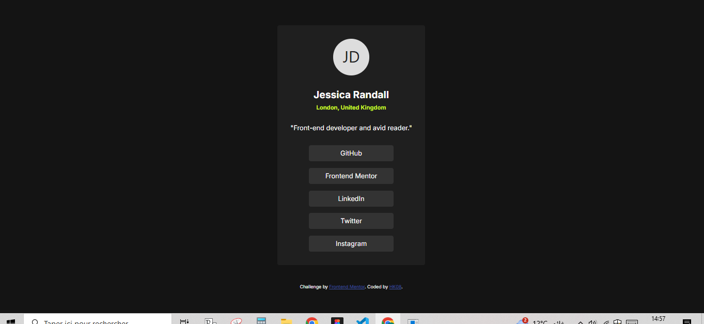
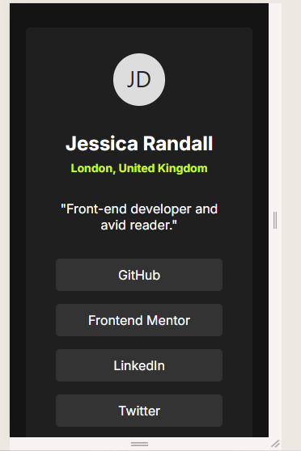

# Social Links Profile

This is my solution to the **Social Links Profile** challenge on [Frontend Mentor](https://www.frontendmentor.io).  
The project demonstrates a responsive profile card with social links built using **HTML** and **CSS**.

## Table of Contents
- [Overview](#overview)
- [Screenshot](#screenshot)
- [Links](#links)
- [Tech Stack](#tech-stack)
- [Features](#features)
- [What I Learned](#what-i-learned)
- [Future Improvements](#future-improvements)
- [Author](#author)

---

## Overview
A simple, responsive social links profile card. Users can:

- View a profile with avatar, name, location, and short career description.
- Access social links with hover and active effects.
- Enjoy a mobile-first responsive layout.

The project follows the design style of Frontend Mentor challenges, with attention to spacing, typography, and color palette.

---

## Screenshot

  
  

*(Replace these with screenshots from your project.)*

---

## Links

- **GitHub Repository:** [https://github.com/HakimDev-tech/social-links-profile](https://github.com/HakimDev-tech/social-links-profile)  
- **Live Site:** [https://hakimdev-tech.github.io/social-links-profile](https://hakimdev-tech.github.io/social-links-profile)  

---

## Tech Stack

- **HTML5** – semantic markup for structure  
- **CSS3** – layout, colors, typography, hover/focus/active effects  
- **Google Fonts** – Inter font family  
- **Responsive Design** – media queries for mobile adaptation  

---

## Features

- Profile avatar with circular crop
- Name, location, and career info
- Vertical list of social links with hover & active effects
- Responsive for mobile and desktop
- Clean, modern dark theme

---

## What I Learned

- How to structure semantic HTML for a simple profile card  
- Using **flexbox** for vertical alignment and spacing  
- Styling hover and active states for links  
- Implementing responsive layout with `@media` queries  

---

## Future Improvements

- Replace placeholder avatar with real images  
- Add CSS transitions or animations for smoother effects  
- Make social links functional with proper URLs  
- Add accessibility enhancements (ARIA labels, keyboard navigation)  

---

## Author

**Abdel Hakim Koumad**  
- GitHub: [HakimDev-tech](https://github.com/HakimDev-tech)  
- Frontend Mentor: [HK08](https://www.frontendmentor.io/profile/HK08)

---

Challenge by [Frontend Mentor](https://www.frontendmentor.io)  
Coded by Abdel Hakim Koumad
